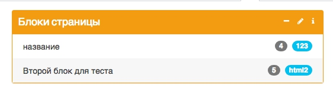
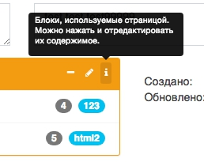
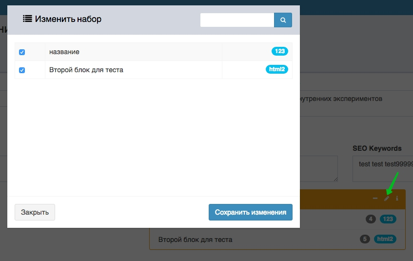
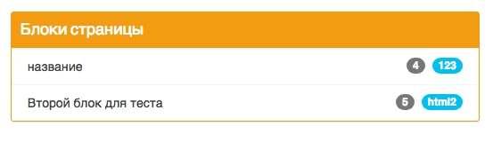

# Handpicked list (yii2 widget)

This widget help you with building admin interface. You can select some elements in pretty interface and see selected items in another pretty compact interface.

Features:
1. "read-only" condition if you want
2. easy search in elements
3. bootstrap admin LTE integration

## Usage:
In view: 
```
<?= HandpickedList::widget([
    'dataProvider' => $handpickedListProvider,
    'modelWithRelations' => 'GeneralPages[manageWidgets]',
    'title' => 'Блоки страницы',
    'readOnly' => false,
    'collapse' => true,
    'usingColumns' => ['id', 'name', 'code', 'own_description'],
    'customSelectionColumn' => 'id',
    'customSelection' => $selectedItems,
]) ?>
```
**Result:**  
Base block (every item is clickable):  


**Hint:**  


**Pop-up with all elemnts:**  


**Collapsed base block:**  


&nbsp;

### Disable all options:
```
<?= HandpickedList::widget([
    'dataProvider' => $handpickedListProvider,
    'modelWithRelations' => 'GeneralPages[manageWidgets]',
    'title' => 'Блоки страницы',
    'readOnly' => true,
    'collapse' => false,
    'usingColumns' => ['id', 'name', 'code', 'own_description'],
    'customSelectionColumn' => 'id',
    'customSelection' => $selectedItems,
]) ?>
```



&nbsp;

## About options:
### 1. dataProvider (array | object)
Seems like:  
`'dataProvider' => $handpickedListProvider,`

`$handpickedListProvider` must be an array:
```
[
    0 => [
        'name' => 'название'
        'code' => '123'
        'checked' => false
        'type' => ''
        'id' => '4'
    ]
    1 => [
        'name' => 'Второй блок для теста'
        'code' => 'html2'
        'checked' => true
        'type' => ''
        'id' => '5'
    ]
]
```
OR object from `ArrayDataProvider`
```
yii\data\ArrayDataProvider#1
   (
       [key] => null
       [allModels] => [
           0 => [
               'id' => '4'
               'code' => '123'
               'name' => 'название'
               'own_description' => 'примечание'
           ]
           1 => [
               'id' => '5'
               'code' => 'html2'
               'name' => 'Второй блок для теста'
               'own_description' => ''
           ]
       ]
       [modelClass] => null
       [id] => null
       [yii\data\BaseDataProvider:_sort] => null
       [yii\data\BaseDataProvider:_pagination] => null
       [yii\data\BaseDataProvider:_keys] => null
       [yii\data\BaseDataProvider:_models] => null
       [yii\data\BaseDataProvider:_totalCount] => null
       [yii\base\Component:_events] => []
       [yii\base\Component:_behaviors] => null
```

### 2. usingColumns (array)
Columns, which will be used for display in widget. Example:  
`'usingColumns' => ['id', 'name', 'code'],`

First normal column will be text title for element. Here is `'name'`

### 3. customSelectionColumn (string)
Column name, which detect selected elements.
default = `'id'`

### 4. customSelection (array)
Array of selected elements in customSelectionColumn.
For example:  
`'customSelection' => [4, 5]`

That`s mean elements with id=4 and id=5 will be selected

### 5. detectedColumns (array)
key - value array, which 'key' is column 'value' is value.
For example:  
`'detectedColumns' => ['code' => 123];`

Every element where code == 123 will be selected.

You can make many rules:  `'detectedColumns' => ['code' => 123, 'id' => '5'];` , but dont create it :-)

Default `['active' => true]`

### 6. modelWithRelations (string)
Specify the model and relations names, which will be save input data (selected items).
For example:
`'modelWithRelations' => 'GeneralPages'`  
or  
`'modelWithRelations' => 'GeneralPages[manageWidgets][anyRelation]'`

in view `'modelWithRelations' => 'GeneralPages[manageWidgets]'` shows as: 

```html
<input type="hidden" name="GeneralPages[manageWidgets][]" value="5">
```
and savings via `manageWidgets` relation.
 
&nbsp; &nbsp; p.s.  
&nbsp; &nbsp; Sorry for this ugly method  
&nbsp; &nbsp; Help me to create good solution.

&nbsp;

## About:
On GitHub: https://github.com/EvgenyVetrov/handpicked-list  
On Packagist: https://packagist.org/packages/atlant5/handpicked-list