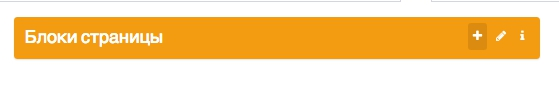

# Handpicked list (yii2 widget)

This widget help you with building admin interface. You can select some elements in pretty interface and see selected items in another pretty compact interface.

Features:
1. "read-only" condition if you want
2. easy search in elements
3. bootstrap admin LTE integration

## Usage:
In view: 
```
<?= HandpickedList::widget([
    'dataProvider' => $handpickedListProvider,
    'title' => 'Блоки страницы',
    'readOnly' => false,
    'collapse' => true,
    'hint' => "Блоки, используемые страницой. Можно нажать и отредактировать их содержимое."
]) ?>
```
**Result:**  
Base block (every item is clickable):  


**Hint:**  


**Pop-up with all elemnts:**  


**Collapsed base block:**  


&nbsp;

### Disable all options:
```
<?= HandpickedListWidget::widget([
    'dataProvider' => $handpickedListProvider,
    'title' => 'Блоки страницы',
    'readOnly' => true,
    'collapse' => false,
    //'hint' => "Блоки, используемые страницой. Можно нажать и отредактировать их содержимое.",
]) ?>
```


&nbsp;

## About:
On GitHub: https://github.com/EvgenyVetrov/handpicked-list  
On Packagist: https://packagist.org/packages/atlant5/handpicked-list